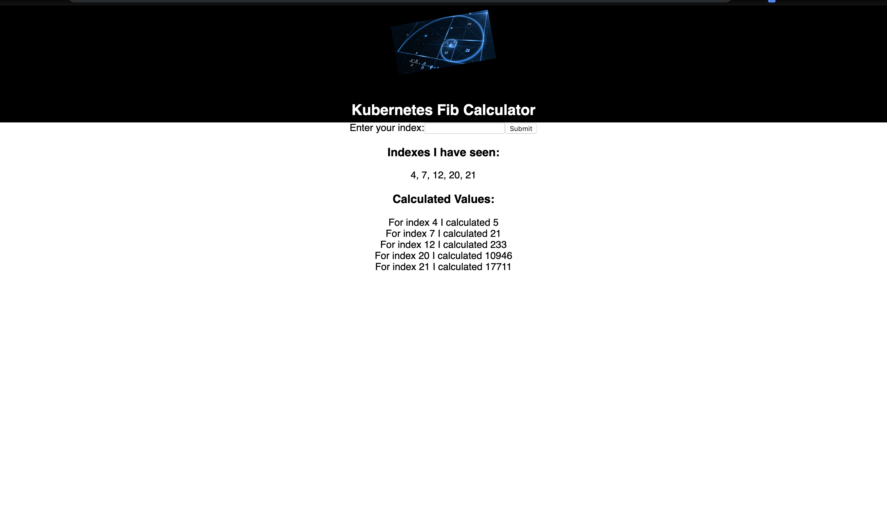

# K8's Fib-Calculator

Web application for calculating the Fibonacci value of a given number. Users first enter a number and submit. The value entered is then stored in a Redis database, and a worker backend application calculates and returns the Fibonacci value of the user entered value upon page refresh. The user entries are stored permanently in a Postgres database and returned to the user.

# Deployment
The application was containerized using Docker and Deployed in a Kubernetes cluster using 
Google Cloud Platform @ https://k8s-fib-calculator.com/

# Built With
Docker  
Kubernetes  
PostgreSQL  
Redis  
Nginx  
Helm  
Google Cloud Platform  
React.js  
Node.js  
Express.js  

# Authors
Tony Bee
